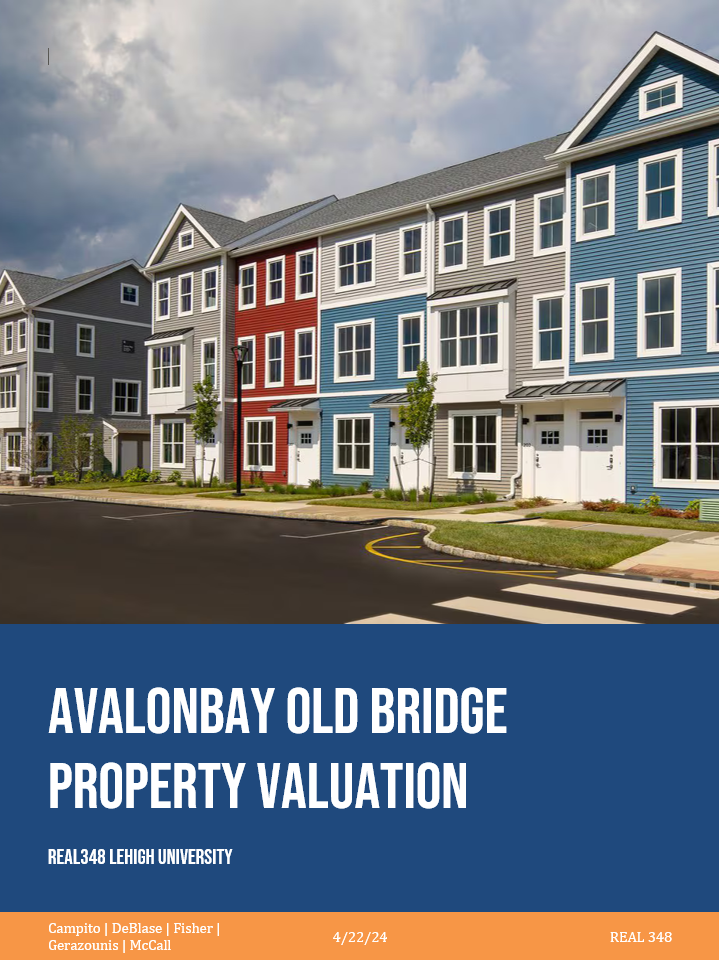

## Portfolio

<!-- You can link to other websites, PDFs in this repo, and other pages in this repo -->

_**[10K Sentiment and its Immediate Affect on Return](report)**_
 
 
This project was for a midterm assignment in my data science for finance course. I analyzed returns based on the sentiment of 10K reports. The analysis looked at the cumulative returns of stocks in the S&P500 immediately following the submission of their 10K. Split up into three different returns, we looked at 1-day, 3-day, and 10-day returns to see how the market reacted.
 
 
We then calculated the correlation between the two variables: sentiment and return. Sentiment was captures 10 different ways, searching a total of five different dictionaries. For example, the 'positive' term dictionaries searched 10K reports for 'positive' words and then assigned a score based on the volume of those words. I created three dictionaries based on different topics that may be discussed in the 10K report, and how positively or negatively they were talked about. The three dictionaries were based on the following: Litigation, Regulation, and Financing Terms.

---

_**[Regression Practice](Regression_practice)**_

Or: The process that created this page can be used to show off your whole midterm analysis file, as is.

<!--  -->

---

_**[Eventual team project]([https://donbowen.github.io/teamproject/](https://github.com/adrianmross/congress_trades_dashboard))**_
 
 
Our team project tracks the portfolios of congress members and their returns. We estimate their portfolio value based on their buys and sells of stocks because the information of their portfolios is not publicly available. We also flag trades for insider trading, based on whether or not the sit on a committee that directly influences the legislation of a stock they buy.

---

_**[Some personal project](/pdf/OldBridge_Valuation_Report_REAL348.pdf)**_

---

## Career Objectives

The end-goal of my career is to say I was able to help others while staying focused on what interests me. My interests are in real estate as mentioned in my about me section, and a core value I live by is selflessness. 
 
A place to live is a universal need and I want to be able to provide that for people. I plan to break into this industry once I have built enough capital and relationships to provide solidarity in my endeavors. Real estate is not an easy market without experience and money!

---

## Hobbies

I enjoy everything adventurous and experiencing new things. Whether it be new ideas, new places, or pretty much new anything, I love learning and challenging myself to new things.
 
To be more specific about my hobbies, I enjoy anything outdoors; from hunting and fishing to hiking and camping. A fun fact about me is that I took a car-camping road trip from my home state of PA all the way to San Diego... and back! I also enjoy building things, most notably the card table my roommate and I built in the woodshop at Lehigh. I don't have many projects to my name, but I am working on a bookshelf currently.
 
Like most people, I value my time with friends and family, so I have to include them somewhere on my site. Any other hobbies I previously mentioned were things both my friends and family helped me enjoy doing!

---

Page template forked from <a href="https://github.com/evanca/quick-portfolio">evanca</a>

<!-- Remove above link if you don't want to attibute -->
